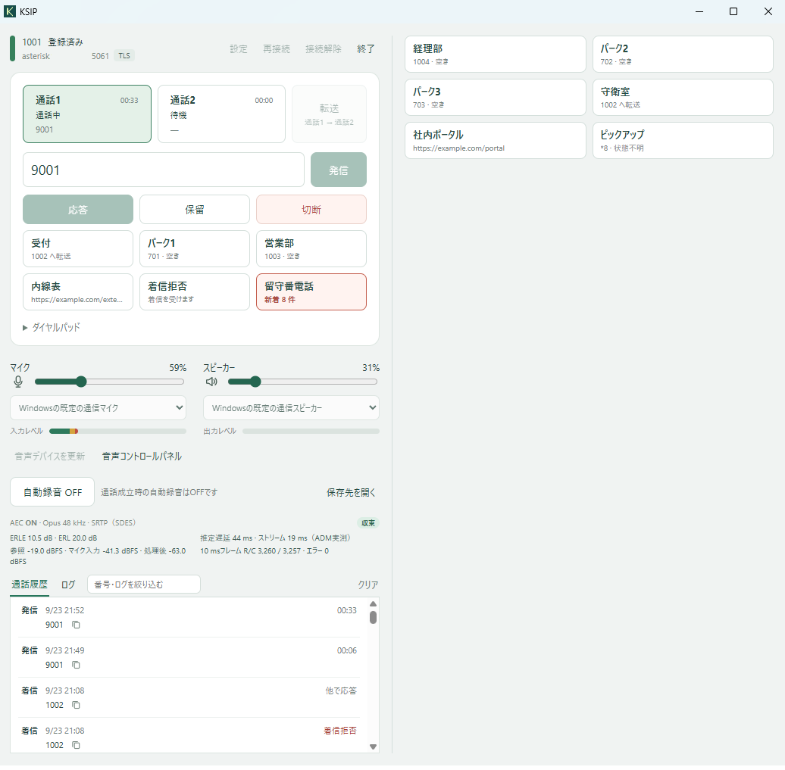

# KSIP

## 概要

Windows用のSIPクライアントです。  
Tauri/Rustで画面と状態管理、baresipでSIP/RTP処理、Google WebRTCでADM/AEC/AGCを、LibreSSLでSIP/RTP通信の暗号化を行います。  
単独exeで動作し、設定値はレジストリで管理するため、GPOによる一斉デプロイ等も可能です。  
主要依存ライブラリのバージョンは以下のとおりです。画面のNPM依存はありません。

- Tauri 2.11.5
- baresip/re 4.11.0
- WebRTC 2026/9/12版
- LibreSSL 4.3.2

## 何を解決し（避け）ようとしているか

- PBXサーバ/通信事業者とSIPクライアントとの密結合
- 謎のインストーラ・サプライチェーン・テレメトリ通信
- ライセンス確認のためのインターネット通信
- 面倒なインストール、個別設定作業（AEC用の遅延計測）、DLL配布
- 古いAEC実装、検証不能ビルド

## 動作要件

- Windows11
- Microsoft WebView2ランタイム

## 主な機能

- 基本的な設定はSIPサーバとアカウント設定のみです。
- サーバとアカウントを設定すると、自動REGISTERします
- アテンド転送、カスタムボタン（転送・BLF付きダイヤル・パーク保留・リンク）、PAIによる番号更新、通話履歴、自動録音、音声デバイス選択などが可能です。
- タスクトレイに常駐し、ショートカットキーで、開く/閉じる・電話に出る/切るが可能です。
- 常駐中は、ブラウザや他のプログラムから、電話をかける・切るなどの制御が可能です。
- 多言語対応です。
- 単一exeで動作し、設定はGPO管理が容易なように、Windows資格情報とレジストリに保存します。
- 音声コーデックはOpus、G.722、G.711（μ-law・A-law）を、既定ではこの順で提示します。設定画面で使うコーデックと順位を変えられます。

## メイン画面の機能



### 転送

「転送」の際は、通話を別の通話に切り替え（切り替え前の通話は自動で保留になります）、転送先に電話をかけた後、転送ボタンを押します。  
例：通話1で着信を取り、通話2に切り替えて転送先に電話、その後転送ボタンを押す。  
SIPサーバーによっては、通話1から通話2への転送（SIPのREFER）を断るものがあります。断られた場合はKSIPが自動で逆向き（通話2から通話1へ）を一度試し、それも駄目なときだけ失敗として知らせます。

### 接続解除・再接続

右上の「接続解除」ボタンから、会議中などの発着信を抑止できます。解除中は着信が来ず、発信もできませんので、「再接続」を忘れないようにしてください。

### 通話履歴

相手の名前（Fromの表示名。P-Asserted-Identityに名前があればそちら）が届いた通話は、通話中の行と履歴に名前を番号の前に出します。
通話が終わるたびに履歴に1行足します。録音ファイル（録音終了後にMP3に変換されます）がある場合は、アイコンで表示します。  
つながらなかった通話は、SIP応答に応じて、通話時間の代わりに理由を出します。  
ただし、PBXが詳細を返さない場合は、正確な理由が表示されない場合があります（CANCELにReasonヘッダをつけない場合は「不在着信」になるなど）。

### マイクの使用

音量・ミュートは、マイクとスピーカーのアイコンとスライダーで制御できます。Windows側の設定なので、同じデバイスを使うほかのアプリにも効きます。

メイン画面が表示されている間は、待機中でもマイクのレベル表示のためにマイクを開いています。Windowsの「マイクが使用中」の表示はこのためです。ウィンドウをタスクトレイにしまうと数秒で閉じ、通話中でなければマイクを使いません。通話中の音声は音声エンジンが別に開きます。

### ログの読み方

同じフォルダに保存される`ksip-log.jsonl`の情報を、新しいものを上にして以下の形式で画面内に表示します。

```text
9/21 9:12:54 [engine] REGISTER_OK 200 OK
```

先頭はローカル日時、続く `[ ]` はその行がどこから来たかを表します。4種類あります。

| タグ     | 由来                                                             | 主な中身                                                                                                                                                                                       |
| -------- | ---------------------------------------------------------------- | ---------------------------------------------------------------------------------------------------------------------------------------------------------------------------------------------- |
| `engine` | 音声エンジンの標準出力・標準エラーを本体が1行ずつ取り込んだもの  | baresip本体のメッセージ、SIPメッセージ全文（`ksip sip >` `ksip sip <`）、音声デバイス（`wasapi/…`）、WebRTCの音声処理（`(…cc:行):`）、録音（`ksip_audio_filter:`）                             |
| `event`  | 音声エンジンが制御チャネルで本体へ送る通知を、本体が整形したもの | `REGISTERING`、`REGISTER_OK`、`CALL_ESTABLISHED`、`CALL_CLOSED` など大文字で始まる行                                                                                                           |
| `app`    | 本体そのもの                                                     | 画面に出したエラーと同じ文言、音声エンジンに渡したマイク・スピーカー（`ksip: microphone …` `ksip: speaker …`）、終了指示から音声エンジンが終わるまでの時間、異常終了や制御接続の切断、パニック |
| `ui`     | 画面（WebView）                                                  | 操作や定期取得の失敗、スクリプトエラー。同じ文言は1分に1回までにまとめます                                                                                                                     |

ログは記録と表示のためのもので、画面の状態はログの文面から作りません。マイクが無音の代替で動いているか、音声処理が動いているか、スピーカーを開始できなかったか、TLSの信頼リストが空かは、音声エンジンが定期的に返す状態から取ります。例外は着信音です。着信音は baresip の `wasapi` モジュールが鳴らし、開始できなかったことはログの行（`wasapi/play: … failed`）でしか分からないため、この行だけから画面にエラーを出します。

## 設定画面で設定できること

設定画面では、以下のような設定が可能です。

### ショートカットキー

設定画面で、以下のグローバルショートカットを設定できます。どちらも既定は空欄で、空欄のキーは登録しません。

| 設定              | 押したとき                                                                 |
| ----------------- | -------------------------------------------------------------------------- |
| `shortcut_window` | ウィンドウが出ていればタスクトレイへしまい、しまってあれば出して前面にする |
| `shortcut_call`   | 着信中なら応答し、それ以外なら選んでいる通話を切る                         |

書き方は `SHIFT+F2`、`CONTROL+ALT+K`、`F3` のように、修飾キーとキーを `+` で区切ります。書き方が違うときは「修飾キーとキーは「+」で区切ってください（例: SHIFT+F2）」、ほかのアプリが既に使っているキーのときは「ほかのアプリで使用されていないキーを指定してください」と設定画面へ出して、保存しません。保存を断ったときは、それまで効いていたキーがそのまま残ります。2つの設定に同じキーは指定できません。

### 通話後にタスクトレイへ戻す

設定画面の「通話が終わったらタスクトレイへ戻す」に秒数を入れると、通話1・通話2の両方が通話中でなくなってからその秒数でウィンドウをしまいます。既定の `-1` では戻しません。途中で着信や発信があれば取りやめます。

### ブラウザ連携

設定画面でプログラム連携とブラウザ連携の両方をONにすると、WebページやメールのリンクからKSIPを操作できます。ブラウザ連携は、プログラム連携がONのときだけONにできます（ブラウザも、KSIPを外から操作するプログラムの1つだからです）。リンクは次の5つです。

| リンク            | 動作                                                                    |
| ----------------- | ----------------------------------------------------------------------- |
| `ksip:<番号>`     | その番号へ発信。`-`、`.`、括弧、空白は取り除きます                      |
| `ksip:<SIP URI>`  | `sip:` で始まる宛先へ、書いたとおりに発信。設定に関係なく確認を出します |
| `ksip:ANSWER`     | 着信に応答                                                              |
| `ksip:HANGUP`     | 選択中の通話を切断                                                      |
| `ksip:SHOWWINDOW` | ウィンドウを前面に出す                                                  |
| `ksip:APP_QUIT`   | KSIPを終了                                                              |

指示の4語は大文字で書きます。番号に使えるのは数字と `*` `#`、先頭の `+` だけで、英字などが残るとエラーを画面に出して発信しません。ブラウザは空白や `#` を `%20` `%23` の形にして渡してくるので、KSIPが元に戻してから読みます。`#` はリンクに書くとブラウザが別の意味に取るため、`%23` と書いてください。

KSIPが起動していないときは、リンクがKSIPを起動し、SIPサーバーへの登録が終わってから実行します（最大25秒）。`APP_QUIT` は起動していなければ何もしません。着信が無いときの `ANSWER` と通話が無いときの `HANGUP` は、ログに残すだけで何もしません。リンクで届いた文字列は、読み取る前の形のまま、すべてログへ `[app] protocol …` として残ります。

### カスタムボタン・カスタム拡張ボタン

設定画面では「カスタムボタン」の見出しを押すと開きます。最大6つのボタンを定義でき、設定したものだけが画面に並びます。  
各ボタンは機能・タイトルと、番号・転送先・ダイヤル先の設定値を持ちます。

| 機能                | 押したとき                                                                                                                                | 番号                                                                      | 転送先                                       | ダイヤル先                                   |
| ------------------- | ----------------------------------------------------------------------------------------------------------------------------------------- | ------------------------------------------------------------------------- | -------------------------------------------- | -------------------------------------------- |
| 転送                | 通話中の相手を番号へブラインド転送します                                                                                                  | 区切りなしの電話番号か SIP URI                                            | 使いません                                   | 使いません                                   |
| ダイヤル（BLFつき） | 番号の使用状況（BLF）を表示します。使用中でなければ番号へ発信し、使用中ならダイヤル先へ発信します（同僚の着信を取るピックアップ番号など） | 区切りなしの電話番号か SIP URI                                            | 使いません                                   | 区切りなしの電話番号か SIP URI（空なら番号） |
| ダイヤル（BLFなし） | 番号へ発信します。使用状況は見張らず、表示もしません。外線の短縮ダイヤルなど、BLF の要らない相手に使います                                | 電話番号か SIP URI                                                        | 使いません                                   | 使いません                                   |
| パーク保留          | 番号の使用状況（BLF）を表示します。使用中でなければ通話中の相手を転送先へブラインド転送し、使用中ならダイヤル先へ発信して取ります         | 区切りなしの電話番号か SIP URI                                            | 区切りなしの電話番号か SIP URI（空なら番号） | 区切りなしの電話番号か SIP URI（空なら番号） |
| リンクを開く        | 番号欄に書いたURL（`http://` か `https://`）をブラウザで開きます                                                                          | `http://` か `https://` で始まるURL                                       | 使いません                                   | 使いません                                   |
| 着信拒否            | 押すたびに着信拒否をON/OFFします。ONの間は着信に話し中（486）で応答し、登録表示に「着信拒否中」と出ます。KSIPを起動し直すと解除されます   | 使いません                                                                | 使いません                                   | 使いません                                   |
| 留守番電話          | 留守番電話の新着件数を表示し（`message-summary` の購読）、押すと番号欄の番号へ発信します。新着があるとボタンが赤くなります                | 留守番電話を聞く区切りなしの電話番号（Asteriskなら `*97` など）か SIP URI | 使いません                                   | 使いません                                   |

- 「番号」欄：そのボタンの基本です。転送では転送する先、ダイヤルでは発信する先、パーク保留とダイヤル（BLFつき）ではBLFで見張る番号、リンクを開くではURL、留守番電話では聞きに行く番号になります。転送先とダイヤル先は空なら番号が使われます。
- 「転送先（使用中でないとき）」欄：パーク保留でだけ使います。番号が空いているときに、通話中の相手をブラインド転送する先です。Asteriskのように「`*701` へ転送すると `701` に駐車される」PBXで、見張る番号（`701`）と転送する先（`*701`）が違うときに書きます。
- 「ダイヤル先（使用中のとき）」欄：ダイヤル（BLFつき）とパーク保留で使います。番号が使用中のときに発信する先です。同僚の内線が鳴っているときに代わりに取るピックアップ番号（`*81002` など）や、パーク保留した通話を取り出す番号がこれにあたります。

- 「区切りなしの電話番号」：数字と `*` `#`（先頭に `+` も可）で30文字以内の、レジストラがそのまま受け取る形です。
- 「電話番号」：RFC 3966（tel URI）の書き方で読める番号です。数字の間に見た目の区切り（`-` `.` `(` `)` と空白）を入れてよく、先頭の `+` は国際番号、先頭の `tel:` は省いても書いても同じです。
- 「SIP URI」：RFC 3261 の `sip:` か `sips:` で始まる完全なURIで、`<sip:61@pbx.example>` のように山括弧で囲んでも構いません。BLFはその番号の `dialog` イベントを購読して得ます。

### カスタムボタンの設定例

| 目的                                                        | 機能                | タイトル                         | 番号                                                           | 転送先 | ダイヤル先                                                  |
| ----------------------------------------------------------- | ------------------- | -------------------------------- | -------------------------------------------------------------- | ------ | ----------------------------------------------------------- |
| 同僚の内線を1押しで呼び、鳴っているときは代わりに取る       | ダイヤル（BLFつき） | 山田                             | `1002`                                                         |        | `*81002`（PBXの直接ピックアップ番号。空なら `1002` へ発信） |
| 通話中の相手を受付へ回す                                    | 転送                | 受付へ                           | `1000`                                                         |        |                                                             |
| 外線の短縮ダイヤル                                          | ダイヤル（BLFなし） | 本社                             | `06-1234-5678`（`+81-6-1234-5678`、`tel:0612345678` でも同じ） |        |                                                             |
| 名前でしか呼べない相手                                      | ダイヤル（BLFなし） | 営業窓口                         | `sip:sales@pbx.example`                                        |        |                                                             |
| Asteriskのパーク（`*701` へ転送で駐車、`701` へ発信で取る） | パーク保留          | パーク1                          | `701`                                                          | `*701` | （空。`701` へ発信して取る）                                |
| 3CXの共有パーク（同じ名前で置く・取る・見張る）             | パーク保留          | SP1                              | `sip:SP1@pbx.example`                                          |        |                                                             |
| 社内の電話帳を開く                                          | リンクを開く        | 電話帳                           | `https://intra.example/phonebook`                              |        |                                                             |
| 会議中は鳴らさない                                          | 着信拒否            | （空。表示言語の「着信拒否」）   |                                                                |        |                                                             |
| 留守番電話の新着を見て、押して聞く                          | 留守番電話          | （空。表示言語の「留守番電話」） | `*97`（Asterisk）、`9999`（3CX）                               |        |                                                             |

「カスタム拡張ボタン」は同じ仕組みのボタンをさらに最大24個（7〜30番）定義するもので、1つでも設定するとウィンドウの幅が2倍になり、右側に2列で並びます。機能と書き方はカスタムボタンと同じです。SIPサーバー側でその番号にBLFが公開されていないと「状態不明」のままです（Asteriskでは `hint` が要ります）。

## その他の機能・必要なファイル

### 他プログラム連携

ブラウザ連携と同じ指示を、コマンドラインからも渡せます。設定画面の「他のプログラムからの操作を受け付ける」（`program_integration`、既定はOFF）がONのときだけ使えます。`browser_integration` には関係ありません（この設定はブラウザに `ksip:` を登録するかどうかだけを決めます）。OFFのときも、窓を出す `ksip:SHOWWINDOW` と終了の `ksip:APP_QUIT` は受け付けます。電話の操作ではないためです。

```text
ksip.exe ksip:<番号>
ksip.exe ksip:ANSWER
```

引数は上の表のリンクをそのまま1つ渡します。ブラウザがリンクを開くときも、Windowsが `ksip.exe` にこの形で渡しています。起動された `ksip.exe` は、常駐しているKSIPへ指示を渡して終了します。常駐していなければKSIPを起動し、受け付けられるようになってから渡します（最大25秒）。発信は `browser_dial_confirm` に従って確認を出すので、無人で発信させたい場合はその設定をOFFにします。

| 終了コード | 意味                                                                                 |
| ---------- | ------------------------------------------------------------------------------------ |
| `0`        | 指示を渡した。`APP_QUIT` で常駐していなかった場合も `0`                              |
| `2`        | 引数が `ksip:` で始まらない                                                          |
| `3`        | 常駐するKSIPを起動できなかった、25秒以内に受け付けなかった、または指示を渡せなかった |
| `4`        | プログラム連携がOFFのため断った（KSIPは起動しない）                                  |

終了コード `0` は指示が届いたことを表し、発信がつながったかどうかは表しません。番号に使えない文字があるなど、読み取ってからのエラーは常駐するKSIPの画面に出ます。指示はすべてログに `[app] protocol …` として残ります。

### 必要なファイル

単一exeで動作し、`ksip.exe` の横には何も書きません。KSIPが書く以下のファイルは、基本的に利用者ごとの `%LocalAppData%\KashiharaCity\ksip\` に置きます。

- 通話履歴：`call-history.jsonl` 2000件を超えると、直近1000件に書き直します。
- ログ：`ksip-log.jsonl` 2000行を超えると、直近1000行に書き直します。詳細ログを有効にしている間は20000行を超えたら直近10000行にします。画面に出るのは今回の起動分だけです。
- 録音：`recordings\` ファイル名は録音を始めた日時と相手の番号で、`2026-09-23_14-30-12_1002.mp3` のようになります。ステレオで、左が相手の音、右が自分の音（エコーキャンセラを通った、相手に送っている音）です。通話が終わるとWAVからMP3へ変換します。変換中は `.converting.mp3` の名前で書き、出来上がってから本来の名前にするので、途中でKSIPを閉じても録音（WAV）は失われず、次の起動時に変換し直します。
- 通知アイコン：`ksip-notification.ico` 起動時に自動で作成します。
- 一時ファイル：`%TEMP%\ksip-profile\` と `%TEMP%\ksip-sound\` に展開します。削除してかまわないファイルです。

## 設定の保存場所

設定情報は、ファイルではなく、Windows資格マネージャと、レジストリに保存します。

### Windows資格情報マネージャーに保存する情報

- SIPアカウント：Windows資格情報マネージャー（汎用資格情報 `KSIP/SIP/default`）

| 欄         | 意味                                                                  |
| ---------- | --------------------------------------------------------------------- |
| ユーザー名 | 認証ID（`auth_user`）。半角英数字と `_` `.` `+` `-` のみ、100文字以内 |
| パスワード | SIPパスワード。512文字以内、制御文字は不可                            |

この2つには既定値がありません。両方そろって初めてアカウントが設定済みになります。
この資格情報が無いうちはアカウント未設定として扱い、接続を試みずに起動時に設定画面を開きます。認証IDを変更する場合はパスワードの再入力が必要です。

### レジストリに保存する情報

- 一般設定：`HKCU\Software\KashiharaCity\ksip`

パスワード以外の設定はこちらです。設定1つにつきレジストリ値1つで、値名は下の表のとおりです。文字列は REG_SZ、整数と真偽は REG_DWORD（真偽は `1`＝ON・`0`＝OFF）で、設定画面から保存したときもこの形で書き戻します。手で書く場合は、整数や真偽を REG_SZ の文字列で書いても読めます（真偽は `true`・`1`・`yes`・`on` と `false`・`0`・`no`・`off`）。
**値が無い場合と、空の文字列の場合は同じ扱いです。** どちらも「値が無いとき」の欄のとおりに動くため、初回起動時にキーが無くても動きます。
型の合わない値（数字でない整数、範囲を超える整数、真偽として読めない文字列、REG_BINARY など）があると、その値名を示して接続しません。範囲外の値や制御文字を含む文字列は保存時と接続時に拒否します。

以前の版が設定をまとめて入れていた `Settings` 値（JSON）は、起動時に削除します。中身は引き継ぎません。

| 値名                   | 型     | 意味                                                                                                                                                                                                                                                                                                                                                                                                                                     | 値が無いとき                                          | JSON書き出し | JSON読み込み  |
| ---------------------- | ------ | ---------------------------------------------------------------------------------------------------------------------------------------------------------------------------------------------------------------------------------------------------------------------------------------------------------------------------------------------------------------------------------------------------------------------------------------- | ----------------------------------------------------- | ------------ | ------------- |
| `server`               | 文字列 | SIPサーバーのホスト名かIPアドレス。半角英数字と `.` `-` のみ、253文字以内                                                                                                                                                                                                                                                                                                                                                                | `127.0.0.1`                                           | ○            | ○             |
| `port`                 | 整数   | SIPサーバーのポート。1〜65535                                                                                                                                                                                                                                                                                                                                                                                                            | `5060`                                                | ○            | ○             |
| `extension`            | 文字列 | 内線番号。半角英数字と `_` `.` `+` `-` のみ、100文字以内                                                                                                                                                                                                                                                                                                                                                                                 | `auth_user` と同じ値を使う                            | ○            | ○             |
| `transport`            | 文字列 | SIPの信号の運び方。`udp`・`tcp`（どちらも暗号化なし）か `tls`。設定画面では「SIPの暗号化」として選び、TLS以外ではSDESとOSRTPは選べません。切り替えると、ポートが既定値のときだけ5060と5061を入れ替えます。これ以外の値は保存も起動も拒否します                                                                                                                                                                                           | `udp`（暗号化しない）                                 | ○            | ○             |
| `media_encryption`     | 文字列 | 音声の暗号化。`sdes`＝SRTP必須（RFC 4568。鍵を信号に載せ、RTP/SAVPで提示する。暗号化できない相手とは通話しない）、`osrtp`＝SRTPを試す（RFC 8643。同じ鍵をRTP/AVPで提示し、相手が鍵を返さなければ平文で通話する。平文から暗号化へ移行する間の設定で、平文になった通話は「暗号化なし」を赤で出す）、`dtls`＝SRTP（鍵をメディア経路で交換）。`sdes` と `osrtp` は `transport` が `tls` でないと保存も起動も拒否し、これ以外の値も拒否します | 暗号化しない                                          | ○            | ○             |
| `codecs`               | 文字列 | 使う音声コーデックと順位。`opus`・`G722`・`PCMU`・`PCMA` を提示する順にカンマ区切りで並べる。書かないものは使わない。名前の重複と知らない名前は保存しない                                                                                                                                                                                                                                                                                | 4つ全部をこの順で提示                                 | ○            | ○             |
| `ca_file`              | 文字列 | 信頼する認証局の証明書（PEM）のパス。400文字以内                                                                                                                                                                                                                                                                                                                                                                                         | Windowsの証明書ストアで検証                           | ○            | ○             |
| `network_adapter`      | 文字列 | 使うネットワークアダプター。`GetAdaptersAddresses()` の `AdapterName`（`{GUID}` 形式）                                                                                                                                                                                                                                                                                                                                                   | 全インターフェイスで待ち受け、送信元はWindowsが選ぶ   | ○            | ×（端末固有） |
| `sip_port`             | 整数   | ローカルSIP待受ポート。1024以上                                                                                                                                                                                                                                                                                                                                                                                                          | `5060`                                                | ○            | ○             |
| `rtp_port`             | 整数   | RTP開始ポート。1024〜65400の偶数で、そこから20ポートを使う。SIPポートと重ならないこと                                                                                                                                                                                                                                                                                                                                                    | `10000`                                               | ○            | ○             |
| `register_interval`    | 整数   | REGISTERの更新周期（秒）。30〜3600                                                                                                                                                                                                                                                                                                                                                                                                       | `300`                                                 | ○            | ○             |
| `pbx_only`             | 真偽   | 登録先のPBX以外から届いた着信や要求を断るか（baresip の `filter_registrar`）。ONのとき登録前は何も受け付けず、TCPとTLSでは待ち受けもしない（通話は登録の接続で届く）。PBXが複数のアドレスから送ってくる構成ではOFFにする                                                                                                                                                                                                                 | ON（断る）                                            | ○            | ○             |
| `microphone`           | 文字列 | 録音エンドポイントID。500文字以内。保存したデバイスが無いときは既定で動作し、設定は変えない。戻ったら「音声デバイスを更新」で戻る                                                                                                                                                                                                                                                                                                        | `default`（Windowsの既定の通信マイク）                | ○            | ×（端末固有） |
| `speaker`              | 文字列 | 再生エンドポイントID。無いときの扱いは `microphone` と同じ                                                                                                                                                                                                                                                                                                                                                                               | `default`（Windowsの既定の通信スピーカー）            | ○            | ×（端末固有） |
| `microphone_gain`      | 整数   | マイクのソフト増幅率（%）。100〜200                                                                                                                                                                                                                                                                                                                                                                                                      | `100`（増幅しない）                                   | ○            | ○             |
| `speaker_gain`         | 整数   | スピーカーのソフト増幅率（%）。100〜200                                                                                                                                                                                                                                                                                                                                                                                                  | `100`（増幅しない）                                   | ○            | ○             |
| `aec`                  | 真偽   | エコーキャンセル（WebRTC AEC3）を有効にするか                                                                                                                                                                                                                                                                                                                                                                                            | ON                                                    | ○            | ○             |
| `aec_delay_ms`         | 整数   | AECの遅延ヒント（ミリ秒）。0〜500。ADMが実測値を返すときはそちらを優先                                                                                                                                                                                                                                                                                                                                                                   | `20`                                                  | ○            | ○             |
| `high_pass`            | 真偽   | ハイパスフィルタ（低域カット）を有効にするか                                                                                                                                                                                                                                                                                                                                                                                             | ON                                                    | ○            | ○             |
| `noise_suppression`    | 文字列 | ノイズ抑制の強さ。`off`、`low`、`moderate`、`high`、`very_high`                                                                                                                                                                                                                                                                                                                                                                          | `high`                                                | ○            | ○             |
| `agc`                  | 真偽   | 自動利得調整（WebRTC AGC2のデジタル利得。マイクの音量は変えない）を有効にするか                                                                                                                                                                                                                                                                                                                                                          | OFF                                                   | ○            | ○             |
| `auto_record`          | 真偽   | 通話成立時に自動録音するか                                                                                                                                                                                                                                                                                                                                                                                                               | OFF（録音しない）                                     | ○            | ○             |
| `auto_answer`          | 真偽   | 着信を即座に応答するか。動作確認用                                                                                                                                                                                                                                                                                                                                                                                                       | OFF（自動応答しない）                                 | ○            | ○             |
| `incoming_action`      | 文字列 | タスクトレイにいるときの着信の扱い。`show`＝ウィンドウを出す、`notify`＝タスクバーへ通知する                                                                                                                                                                                                                                                                                                                                             | `show`（ウィンドウを出す）                            | ○            | ○             |
| `tray_after_call`      | 整数   | 通話が終わって通話1・通話2の両方が通話中でなくなってから、ウィンドウをタスクトレイへしまうまでの秒数。-1〜3600（REG_DWORD では -1 を `0xFFFFFFFF` で書く）。途中で着信や発信があれば取りやめ                                                                                                                                                                                                                                             | `-1`（しまわない）                                    | ○            | ○             |
| `program_integration`  | 真偽   | 他のプログラムからの操作（`ksip.exe ksip:<番号>`、`ANSWER`、`HANGUP`）を受け付けるか。OFFのときは終了コード `4` で断る。窓を出す `SHOWWINDOW` と終了の `APP_QUIT` は設定に関係なく受け付ける                                                                                                                                                                                                                                             | OFF（受け付けない）                                   | ○            | ○             |
| `browser_integration`  | 真偽   | `ksip:` のリンクを受け付けるか。`program_integration` もONのときだけ効き、そのとき起動時と設定保存時に `HKCU\Software\Classes\ksip` へ登録し、それ以外では消す。`program_integration` がOFFの間も値はそのまま残す                                                                                                                                                                                                                        | OFF（受け付けない）                                   | ○            | ○             |
| `browser_dial_confirm` | 真偽   | リンクからの発信前に確認するか                                                                                                                                                                                                                                                                                                                                                                                                           | ON（確認する）                                        | ○            | ○             |
| `language`             | 文字列 | 画面の言語。`ja`・`en`・`zh-TW`                                                                                                                                                                                                                                                                                                                                                                                                          | 空欄。Windowsの表示言語に合わせ、対応が無ければ日本語 | ○            | ○             |
| `shortcut_window`      | 文字列 | ウィンドウを出す・しまうグローバルショートカット。`SHIFT+F2` のように修飾キーとキーを `+` で区切る                                                                                                                                                                                                                                                                                                                                       | ショートカットを使わない                              | ○            | ○             |
| `shortcut_call`        | 文字列 | 電話に出る・切るグローバルショートカット。書き方は同じ                                                                                                                                                                                                                                                                                                                                                                                   | ショートカットを使わない                              | ○            | ○             |
| `sound_ring`           | 文字列 | 着信音に使うWAVのパス。400文字以内                                                                                                                                                                                                                                                                                                                                                                                                       | 内蔵音を鳴らす                                        | ○            | ○             |
| `sound_ringback`       | 文字列 | 呼出音に使うWAVのパス。48 kHzモノラルに限り、保存時に確認する                                                                                                                                                                                                                                                                                                                                                                            | 内蔵音を鳴らす                                        | ○            | ○             |
| `sound_busy`           | 文字列 | 話中に使うWAVのパス                                                                                                                                                                                                                                                                                                                                                                                                                      | 内蔵音を鳴らす                                        | ○            | ○             |
| `sound_notfound`       | 文字列 | 宛先なしに使うWAVのパス                                                                                                                                                                                                                                                                                                                                                                                                                  | 内蔵音を鳴らす                                        | ○            | ○             |
| `sound_error`          | 文字列 | エラーに使うWAVのパス                                                                                                                                                                                                                                                                                                                                                                                                                    | 内蔵音を鳴らす                                        | ○            | ○             |
| `detail_log`           | 真偽   | 障害調査用の詳細をログへ出すか。SIPメッセージ全文（認証ヘッダーは伏字）、baresipのデバッグ行、WebRTC音声処理の情報行が増える                                                                                                                                                                                                                                                                                                             | OFF（出さない）                                       | ○            | ○             |
| `button_<n>_title`     | 文字列 | カスタムボタン n（1〜6。7〜30は拡張ボタン）のタイトル。40文字以内。空なら番号を出す（`dnd`・`mwi` は表示言語の「着信拒否」「留守番電話」）                                                                                                                                                                                                                                                                                               | 番号を出す                                            | ○            | ○             |
| `button_<n>_kind`      | 文字列 | ボタン n の機能。`transfer`＝転送、`dial`＝ダイヤル（BLF付き）、`speed`＝ダイヤル（BLFなし）、`park`＝パーク保留（BLF付き）、`open`＝リンクを開く、`dnd`＝着信拒否、`mwi`＝留守番電話                                                                                                                                                                                                                                                    | 空（ボタンを出さない）                                | ○            | ○             |
| `button_<n>_number`    | 文字列 | ボタン n の番号。数字と `*` `#`（先頭に `+` も可）で30文字以内、または `sip:` で始まるSIP URI。`speed` では RFC 3966 の区切り（`-` `.` `(` `)` と空白）と `tel:` の接頭辞も可。`open` では `http://` か `https://` のURL                                                                                                                                                                                                                 | 空                                                    | ○            | ○             |
| `button_<n>_transfer`  | 文字列 | `park` のときだけ。番号が空きのときに通話中の相手を転送する先。空なら `button_<n>_number` へ転送                                                                                                                                                                                                                                                                                                                                         | 番号と同じ                                            | ○            | ○             |
| `button_<n>_pickup`    | 文字列 | `dial` と `park` のとき。番号が使用中のときに発信する先（ダイヤル先。ピックアップ番号など）。空なら `button_<n>_number` へ発信                                                                                                                                                                                                                                                                                                           | 番号と同じ                                            | ○            | ○             |

「JSON書き出し」と「JSON読み込み」の列は、設定画面の「書き出し」「読み込み」ボタン（書き出しは `ksip.exe --export-settings` も同じ）の対象かどうかです。マイク・スピーカー・ネットワークアダプターは端末ごとに違うので、書き出しには含めますが読み込みでは入れません。資格情報（認証IDとパスワード）はどちらの対象でもありません（書き出しにはサインイン済みかどうかだけが入ります）。

`ca_file` を指定する場合はそのファイルで、指定がない場合は、Windowsの「信頼されたルート証明機関」の証明書で検証します。ただし、Windows がTLSのサーバーについて信頼しないルートは使いません。「信頼されていない証明書」にあるもの、用途の制限（管理者や Microsoft の CTL による）にサーバー認証が無いもの、不信任の日付を過ぎたものです。反映するのはルートだけで、「信頼されていない証明書」にある中間CAをサーバーが送ってきても止められません。期限切れの証明書と、エンジンの TLS ライブラリが読めない証明書も、検証に使用しません。起動のたびに、使った数と外した数をログに `[app] ksip: windows trust store …` として残します。
`media_encryption` に `sdes` か `osrtp` を選ぶ場合は `transport` を `tls` にしてください。SDESは鍵を信号に載せるため、信号が平文では意味がありません（保存時に拒否します）。

### グループポリシー（ADMX）

`docs/admx/` に管理用テンプレートがあります。`ksip.admx` と言語別の `ja-JP\ksip.adml`・`en-US\ksip.adml` を、ドメインのセントラルストア（`\\<ドメイン>\SYSVOL\<ドメイン>\Policies\PolicyDefinitions\`）か端末の `%WINDIR%\PolicyDefinitions\` に同じ構成で置くと、「ユーザーの構成 > 管理用テンプレート > KSIP」に出ます。

なお、**このテンプレートはテスト中です。** Windows サンドボックスの中で gpedit に読み込み、代表的なポリシーの有効・無効・未構成で書かれる値を確かめています（下の `scripts/test/sandbox-admx.py`）。ドメインの GPMC から配布した場合の動作は、まだ確認していません。

- ポリシーは上の表と同じ値名・同じ型で `HKCU\Software\KashiharaCity\ksip` に書きます。`Software\Policies` 配下ではないため、ポリシーを外しても値は残り、利用者が設定画面で保存すると次のポリシー更新までその値に変わります。
- 未構成は値に触れません。無効にすると、真偽の設定は `0`（OFF）を書き、それ以外は値を消して既定値に戻します。
- 端末や利用者ごとに異なる `microphone`・`speaker`・`network_adapter`・`extension` と、資格情報（認証IDとパスワード）は含めません。
- カスタムボタンは1ボタン1ポリシーで、5つの値をまとめて書きます（無効で5つとも消してボタンを出さない）。

配布した値を KSIP がどう読んだかは、端末で次のようにJSONに書き出して確かめられます。窓もエンジンも起動せず、ファイルを書いて終わります。

```powershell
ksip.exe --export-settings C:\temp\ksip-settings.json
```

中身は次のとおりです。パスワードは含めません。

- `settings`: KSIP が読んだ設定（値が無い項目は既定値で埋め、名前は正規化したもの）
- `account`: `server`・`port`・`extension` と、サインイン済みかどうか（`signed_in`）、資格情報を読めなかったときはその理由
- `unreadable`: 型が合わないなどで読めなかった値名（設定とアカウントの両方）
- `save_complete`: 途中で終わった保存が無いか
- `settings_valid`・`settings_error`: 設定が読めて検査に通るか
- `account_valid`・`account_error`: サーバー・ポート・内線番号が検査に通るか（資格情報とは別に見る）
- `valid`・`error`: 接続するときと同じ検査（保存の途中印、資格情報、アカウント、設定の順）に通るか。接続時と書き出しは同じ関数を使います
- `stored`: 各値を KSIP が書き戻すとしたときの型と値

設定画面の「書き出し」は、同じ中身を選んだファイルに書きます（画面で編集中の値ではなく保存済みの値）。「読み込み」は、書き出したファイル（またはその一部だけを残したファイル）の値を設定画面に入れます。ファイルに無い項目と、マイク・スピーカー・ネットワークアダプターは今の値のまま残し、元の端末で読めなかった値（`unreadable`）、型や範囲の合わない値、この版に無い選択肢（転送方式・暗号化・ノイズ抑制・着信時の動作・コーデック・ボタンの機能）は入れずに名前を示します。選択肢は大文字小文字の違いを画面の表記にそろえて入れます（`TLS` は `tls`、`pcmu` は `PCMU`）。ファイルの値を入れると SDES・OSRTP が TLS 以外と組み合わさる場合と、ファイルの値を画面にそのとおり出せない場合は、ファイル全体を読み込まず画面を元のままにします。読み込みで値が別の値に変わること（暗号化が「なし」になる、コーデックが「すべて」になる）はありません。保存は「保存して接続」を押したときだけです。

設定画面は、保存済みの値やポリシーの値が一覧に無い選択肢でも空にせず「この版に無い値」として出し、そのまま保存しようとすると保存時の検査で止めます。SIP の転送方式を TLS 以外に変えても、選んであった SDES・OSRTP は外さずに「TLS と組み合わせてください」と示します。コーデックを1つも選ばない保存はしません（空の指定は「すべて使う」の意味になるため）。

`network_adapter` を指定すると、登録もRTPもそのアダプターから出ます。待ち受けるアドレスは、保存した値ではなく**接続のたびにアダプターから解決**します。アドレスが変わったときは、通話中でなければ自動で接続し直します（通話中は終わるまで待ちます）。指定したアダプターが無い場合は「指定NICが見つかりませんでした」、アドレスを持たない場合は「指定NICのIPアドレスが取得できませんでした」として保存・接続を拒否します。

`sound_ring`〜`sound_error` に指定したファイルは、起動時に16bit PCMへ変換します。読めない形式や見つからない場合も内蔵音のままとし、理由をログへ残します。呼出音だけは通話用の再生経路（48 kHzモノラル）を通るため、その形式のWAVに限ります。通話中の着信は画面に出るだけで、音は鳴りません。

カスタムボタンは標準のSIPだけで動きます。BLFは番号への `dialog` イベントの購読（SUBSCRIBE/NOTIFY、`application/dialog-info+xml`）、発信は番号への INVITE、転送は番号への REFER です。どの番号へ転送すると駐車されるか、どの番号にBLFが出るかはSIPサーバー側の設定に合わせて書きます。 転送先を `<sip:61@127.0.0.1>` のようにSIP URIで書いた場合は、山かっこも含めて書いたとおりに Refer-To に載せます（SIPサーバーが設定された形だけを受け付けることがあるため）。

- 通知設定:`HKCU\Software\Classes\AppUserModelId\local.ksip.client`

Windowsの通知は、アプリの識別子（AUMID）をたどって表示名とアイコンを決めます。KSIPは起動のたびに、現在のユーザーへ次を書きます。管理者権限は要りません。

```text
  DisplayName = KSIP
  IconUri     = %LocalAppData%\KashiharaCity\ksip\ksip-notification.ico
```

- ブラウザ連携設定:`HKCU\Software\Classes\ksip`

`program_integration` と `browser_integration` の両方がONのとき、KSIPは起動時と設定保存時に次を書きます。現在のユーザーにだけ登録するので管理者権限は要りません。どちらかがOFFなら `ksip` キーごと削除します。

```text
  (既定)                    = URL:KSIP Protocol
  URL Protocol              = （空文字）
  DefaultIcon
    (既定)                  = <ksip.exeのフルパス>,0
  shell\open\command
    (既定)                  = "<ksip.exeのフルパス>" "/ksip=%1"
```

## 開発に関する方針

以下は利用者・管理者向けではなく、開発やテストに関する記述です。

- ビルド手順は固定し、再現可能なビルドを目指します。（ネイティブは `scripts/build/native.ps1`、本体は `scripts/build/app.ps1`）
- 依存は公式の取得元から取り、lockとハッシュで固定します。公開から7日未満の版は追加しません。更新したら `scripts/test/supply-chain.py` を通します。
- `src-web/` はHTML・CSS・最小限のvanilla JavaScriptのままにし、npm依存を追加しません。
- テスト・ビルドスクリプトはPowerShellとPythonだけです。冒頭に必ず用途を記載します。PowerShellはMSVC環境が要るものとUIAutomationを使うものに限り、それ以外はPython標準ライブラリで書きます。テスト用にthird-party依存を追加しません。
- 生成物はGit管理しません。テスト生成物は `temp/build/`、テストと監査の結果は `temp/reports/` に置きます。
- 開発用にSIPサーバーを配置する場合は、接続先と資格情報を `test-pbx/` の下にPBXごとのフォルダーを作って置きます（開発用のAsteriskは `test-pbx/local-asterisk/`）。表示もログ出力もGit追加も配布もしません。

## リポジトリの構成

```text
.gitattributes       追跡する文字ファイルをどの環境でもCRLFで取り出す指定
rust-toolchain.toml  ビルドに使うRustの版。ランナーと手元で同じ版にする
.cargo/config.toml   Cargoの出力先と既定のrustflags
deps/                ネイティブ原本のロックと、取得したまま手を加えていない
                     ハッシュ固定済みアーカイブ。どちらもGit管理する
licenses/            Rust依存の補完ライセンス
docs/                READMEに載せる画面の画像
src-web/             HTML・CSS・vanilla JavaScriptの画面（app.js を入口に ES modules で分割。npm なし）
src-web/locales/     言語ファイル
src-tauri/           Rust/Tauriのソースと固定設定
src-native/          KSIP固有のC/C++ソースとビルド定義
scripts/dev-env.ps1  MSVCツールチェーンとPATH。ビルド・テストの共通土台
scripts/deps/        固定版の依存を取得する。ネットワーク必須、依存更新時のみ
scripts/build/       取得済みの依存からビルドする。オフライン、毎回
scripts/test/        テスト。app-・pbx-・loopback-で対向先を示す。run.py で全部を順に流す
```

ビルド用の一時生成物、テスト結果、キャッシュ、展開した依存ソースはすべて `temp/` に作られ、Git管理しません。

```text
release/             `ksip.exe` と `ksip-v<version>.exe`。運用時はここに履歴・録音・通知アイコンも増える
temp/build/          ビルド中間生成物とテスト用ファイル
temp/reports/        テスト・監査結果
temp/cargo-target/   Cargoキャッシュと中間生成物
temp/vendor/         固定アーカイブから展開する依存ソース
temp/w/・temp/d/     パス長を抑えたGoogle WebRTC・depot_tools
```

## ビルド

ビルドは、Windowsマシンで行います。

### ビルドに必要な環境

- Windows x64
- Visual Studio Build Tools 2022のC++ツールセット
- Windows SDK 10.0.28000.0とDebugging Tools for Windows
- Rust/Cargo
- Python 3.13
- cargo-audit（`cargo install cargo-audit --locked`）

### ビルド手順

この順で実行します。1・2は環境構築時と依存更新時だけ、3・4は毎回です。

```powershell
python -X utf8 scripts/deps/fetch-baresip.py
python -X utf8 scripts/deps/fetch-webrtc.py
powershell -NoProfile -ExecutionPolicy Bypass -File scripts/build/native.ps1
powershell -NoProfile -ExecutionPolicy Bypass -File scripts/build/app.ps1
```

`deps/fetch-baresip.py` はbaresip・re・Opus・libg722・LibreSSLの固定アーカイブをハッシュ検証します。
`deps/fetch-webrtc.py` は固定した公式Google WebRTCとdepot_tools revisionをパス長対策済みの `temp/w/`・`temp/d/` へ`gclient`で取得してDEPSも検証します。
`build/native.ps1` は内部で `build/webrtc.ps1` を呼びます。
`build/app.ps1` は `build/embed-notices.py` を呼んでから `release/` の `ksip.exe` と `ksip-v<version>.exe` を置き換えます。運用中のフォルダをそのままビルド先にできるよう、履歴や録音には触れません。配布物を作る場合は最後に `python -X utf8 scripts/build/package.py` を実行します。

`build/app.ps1` はビルド機のパスがバイナリへ残らないよう、`RUSTFLAGS` を組み立ててcargoへ渡します。これは `.cargo/config.toml` の `rustflags` を置き換えるため、静的CRTの指定も同じ場所に書いてあります。外部DLLへの依存が残れば `test/app-single-exe.ps1` が失敗します。

配布するexeは、どちらのスクリプトにも `-Clean` を付けて作ります。`native.ps1 -Clean` はCMakeのビルドディレクトリを消してから組み、以前の検出結果（古いキャッシュで `HAVE_LIBRESSL` が外れ、`http/server.c` の内容が変わった例があります）を引き継ぎません。`app.ps1 -Clean` は `cargo clean --release` を先に行います。

```powershell
powershell -NoProfile -ExecutionPolicy Bypass -File scripts/build/native.ps1 -Clean
powershell -NoProfile -ExecutionPolicy Bypass -File scripts/build/app.ps1 -Clean
python -X utf8 scripts/test/build-paths.py
```

同じコミットをどの環境で組んでも同じexeになるように、ソースの改行は `.gitattributes` でCRLFに固定してあります。`src-web/` はそのままexeへ埋め込まれるため、取り出しの改行が違えば別のexeができます（Rust と C/C++ はコンパイラが改行を正規化するので影響しません）。`test/line-endings.py` が `src-web/` の改行を見ます。

## テスト

テストの共通部品は `test/sip_fixture.py`（SIP端末の起動と制御、資格情報、通話確立、`lab.json` の読み取り）、`test/app_fixture.py`（使い捨てプロファイルと対向端末）、`test/app-fixture.ps1`・`test/ui-automation.ps1`（アプリの起動・終了とUIAutomation操作）です。製品のバージョンは `src-tauri/Cargo.toml` から読むため、版を上げてもテスト側の修正は要りません。

テスト用の使い捨てプロファイルは `KashiharaCity\ksip\Test\<プロファイル名>` に作られ、終了時に削除します。

### 対向の要らないテスト

```powershell
powershell -NoProfile -ExecutionPolicy Bypass -File scripts/test/rust.ps1
powershell -NoProfile -ExecutionPolicy Bypass -File scripts/test/aec.ps1
powershell -NoProfile -ExecutionPolicy Bypass -File scripts/test/audio-module.ps1
python -X utf8 scripts/test/audio-devices.py
python -X utf8 scripts/test/supply-chain.py
python -X utf8 scripts/test/i18n.py
python -X utf8 scripts/test/settings-dialog.py
python -X utf8 scripts/test/no-secrets.py
python -X utf8 scripts/test/build-paths.py
python -X utf8 scripts/test/line-endings.py
python -X utf8 scripts/test/admx.py
```

`test/aec.ps1` は通常、ABIとステレオサンプル数の契約に加え、80 ms遅延させた合成エコーを実製品と同じAPM経路へ入力し、抑圧量・ERL・ERLE・推定遅延をテストします。既定の通信スピーカーをADMで開くテストは `KSIP_TEST_AUDIO_DEVICE=1`、短い確認音がWindowsの出力へ実際に到達するテストは `KSIP_TEST_AUDIO_SIGNAL=1` を設定して実行します。

`test/audio-module.ps1` は音声モジュールのうち機器も baresip も要らない部分を単体で試します。再生ストリームの引継ぎ（新しいプレーヤーが取り、去れば前のプレーヤーへ返す、起動に失敗した切替は取り上げた相手へ返す）、マイクが開かないときの無音の代替、状態の報告（入力が機器か無音か、再生しているか、失敗した開始の数）が失敗・引継ぎ・取り直しの後も実際と合うこと、コールバック解除中の競合（実行中の呼び出しを待つ、呼び出しの中からの解除は待たない）、WAV 録音のバッファと見出しです。

`test/audio-devices.py` にはWindowsの実音声デバイスが必要です。

`test/no-secrets.py` は、Gitが追跡しているファイルに私有IPアドレス・社内ホスト名・秘密らしき文字列・鍵や証明書の中身が混ざっていないかを調べます。開発用サーバーの接続先はリポジトリに置かず `test-pbx/` から読む決まりで、この検査がそれを守ります。

`test/admx.py` は、`docs/admx` のテンプレートと、`release/ksip.exe --export-settings` が空のテスト用プロファイルから書き出す既定の設定を突き合わせます。テンプレートが書く値名がすべて KSIP の設定にあり、KSIP の設定のうち意図して外したもの（`microphone`・`speaker`・`network_adapter`）以外がすべてテンプレートにあり、型（数値と真偽は REG_DWORD、文字列と選択は REG_SZ）と画面の初期値が KSIP と一致することを確かめます。あわせて、テンプレートの XML をわざと壊した写し（真偽の無効時の値が無い、数値を文字列で書く、設定のポリシーが無い、KSIP に無い値名）でこれらの検査が失敗することも確かめます。設定を足したのにテンプレートを直し忘れた、を止めるためのもので、1秒かかりません。

`test/build-paths.py` は、ビルドした `release/ksip.exe` に組んだ機械の絶対パス（利用者のフォルダ、リポジトリの場所、cargoのレジストリ）が残っていないかを調べ、結果を `temp/reports/build-paths.json` に残します。`test/line-endings.py` は、`src-web/` の追跡ファイルが作業ツリーでCRLFであることを確かめます。改行がexeへ届くのはここだけです。どちらも数秒で終わります。

`test/i18n.py` は、本体とエンジンのKSIPモジュールが報告する名前を集め、画面の文言表とWindows用の表に過不足がないか、値を渡す名前と `{0}` を含む文言が対応しているかを検査します。対向も画面も要らず、数秒で終わります。

`test/settings-dialog.py` は、設定画面の実物の `src-web/settings.js` をページごと headless の Microsoft Edge（Windows 11 に入っているもの）で動かし、Tauri の呼び出しだけをテストが答えて、読み込んだファイルの値や保存済みの値が画面にそのとおり出て、保存用の値として別の値に変わらないことを確かめます。SDES・OSRTP と UDP・TCP の組み合わせになるファイルを断って画面を元のまま残すこと、一覧に無い選択肢を空にせず残すこと、小文字のコーデック名を画面の表記で入れること、コーデックを1つも選ばない保存をしないこと、などです。本体のビルドも対向も要らず、数秒で終わります。

`test/supply-chain.py` はRustクレートの公開日とチェックサム、ネイティブ原本のハッシュとrevision、npm依存が無いことを検証し、続けて `cargo audit` で `Cargo.lock` のRustSec勧告を照会します。脆弱性が1件でもあれば失敗し、結果は `temp/reports/cargo-audit.json` に残します。unmaintained・unsoundの警告は記録だけして通します。

### 開発用SIPサーバーが要るテスト

```powershell
python -X utf8 scripts/test/pbx-transfer.py
python -X utf8 scripts/test/pbx-codec.py
python -X utf8 scripts/test/pbx-tls.py
python -X utf8 scripts/test/pbx-osrtp.py
python -X utf8 scripts/test/pbx-pai.py
python -X utf8 scripts/test/pbx-record-switch.py
python -X utf8 scripts/test/pbx-early-media.py
python -X utf8 scripts/test/pbx-playback.py
python -X utf8 scripts/test/pbx-live-aec.py
powershell -NoProfile -ExecutionPolicy Bypass -File scripts/test/app-walkthrough.ps1
```

開発には Asterisk 22.11.0（codec_opus 1.3.0、`res_pjsip_rfc3326` を読み込む）、FreeSWITCH 1.11.3、3CX 20.0.9を使いました。

`pbx-*.py` は実際のSIPサーバーへ登録して発着信し、`app-*.ps1` はビルド済みの `release/ksip.exe` をUIAutomationで操作します。どちらも接続先と内線を `test-pbx/<フォルダー>/lab.json` から読みます。フォルダーは環境変数 `KSIP_TEST_PBX` で選び、既定は `local-asterisk` です（`test-pbx/` はGit管理外なので、公開されるのは手順だけです）。同じテストをAsteriskとFreeSWITCHの両方に対して流せるように、PBXごとの約束事（番号や証明書）はすべて `lab.json` に書きます。テスト実行時にパラメータが足りなければ、何が足りないかを言って止まります。

```json
{
  "server": "<開発用SIPサーバーのIP>",
  "port": 5060,
  "tls_host": "<TLSで使うホスト名>",
  "tls_port": 5061,
  "server_certificate": "test-pbx/<フォルダー>/<サーバー証明書>.crt",
  "ca_certificate": "test-pbx/<フォルダー>/<CA証明書>.crt",
  "accounts": [
    { "extension": "1001", "password": "<パスワード>", "encryption": "osrtp" },
    { "extension": "1002", "password": "<パスワード>", "encryption": "osrtp" },
    { "extension": "1003", "password": "<パスワード>", "encryption": "osrtp" },
    { "extension": "1004", "password": "<パスワード>", "encryption": "dtls" },
    { "extension": "1005", "password": "<パスワード>", "encryption": "sdes" }
  ],
  "numbers": {
    "playback": "9001",
    "park_slots": ["701", "702", "703"],
    "park_prefix": "*",
    "group": "7000",
    "voicemail": "*97",
    "voicemail_direct_prefix": "8",
    "unassigned": "1999",
    "early_media": "1006",
    "park_watch": "{slot}"
  },
  "features": { "connected_identity": true }
}
```

`accounts` は書いた順に使います。テストは1件目と2件目の両方に登録してから、その間で発着信します（`app-*.ps1` では1件目がKSIP本体、2件目がPython側の相手）。`pbx-record-switch` は3件目も使います。`encryption` はサーバー側でその内線がどう振る舞うかで、`none`（平文）、`osrtp`（鍵をRTP/AVPで提示し、平文も受ける。Asteriskの `media_encryption_optimistic=yes`）、`sdes`（SRTP必須）、`dtls`（DTLS-SRTP必須）のどれかです。先頭3件は平文で使うので `none` か `osrtp` にします。`pbx-tls` は `sdes` の内線と `dtls` の内線を使い、`pbx-osrtp` は `osrtp` の内線があるときだけ動きます（FreeSWITCHはOSRTPの提示に規格どおりの応答を返さないので、その開発機では `none` にしてあります）。`ca_certificate` はTLSの検証に使う認証局の証明書で、省略するとそのフォルダーの `LocalCA.crt` です。別のPBXと同じ認証局を指してもかまいません（FreeSWITCHの開発機はAsteriskと同じ認証局が発行した証明書を使っています）。`numbers` はサーバー側の約束事で、省略した項目は上の値になります。`park_watch` は駐車枠のBLFで購読する相手で、Asteriskは枠の番号そのもの、FreeSWITCHは `sip:park+{slot}@{server}`（valet parkingが公開する名前）です。`features` には、そのPBXが持たない振る舞いを `false` で書きます。対応するテストは「SKIP:」と理由を出して正常終了するか、その段だけ「NOTE:」と出して先へ進みます。`connected_identity` は保留取得時に相手の番号を P-Asserted-Identity で知らせること、`windows_trust` はそのサーバー証明書がWindowsの証明書ストアの認証局につながること、`unassigned_rejected` は無い番号への発信を404などの応答で断ること（案内を流して応答するPBXでは `false`。3CXの既定はこちら）です（FreeSWITCHの開発機では `connected_identity` が `false`）。

サーバー側には、自動応答して音を流す番号（`playback`）、`park_prefix` を付けた番号へ転送すると駐車され同じ番号へ発信すると取得できる駐車枠（`park_slots`。dialogイベントの購読に応えること）、1件目と3件目の内線を同時に鳴らすグループ（`group`。他方が取ったときのCANCELに `Reason` ヘッダーを付けること）、留守番電話（`voicemail` で自分の箱、`voicemail_direct_prefix` + 内線番号でその箱へ直接録音、1件目と2件目の内線は応答しないと留守番電話に落ちること）、各内線の dialog イベント（BLF）が要ります。3件目以降の内線は留守番電話に落とさず、話中や応答なしがSIPの応答のまま返ること。SRTP必須の内線（`sdes`）とDTLS-SRTPの内線（`dtls`）が1つずつあること。任意で、応答前に183で音を流してから応答する番号（`early_media`。開発用Asteriskでは `Progress()` と `Playback(...,noanswer)` の後に `Answer()`）があれば、`pbx-early-media.py` がアーリーメディア中の録音の振る舞いを確かめます。無ければそのテストは飛ばします。留守番電話のテストは、声の入った短いWAV（48 kHz・モノラル・16 bit）を `test-pbx/irodori-rusuden.wav` に置いておくと、それを話者として流します。無音だけの録音を捨てるPBX（3CX）があるためです。

`app-settings-file.ps1` は、設定画面の「書き出し」と「読み込み」を Windows のファイルダイアログごと試します。書き出したファイルが保存済みの設定と同じこと、読み込みは画面に入れるだけで保存せずに閉じれば元のままのこと、保存すると読み込んだ値が残り、端末固有の値・元の端末で読めなかった値・型の違う値は入らないことを確かめます。

`app-settings.py` は、テンプレートが書くのと同じ型の値をテスト用プロファイルへ置き、`ksip.exe --export-settings` で読み戻します。全ポリシーを既定と違う値で同時に有効にした状態、各数値の最小値、各選択肢（SDES と OSRTP は TLS と組で）が、書いたとおりに読まれて設定とアカウントの検査に通ること、各数値の最小値より1小さい値が拒まれること、型の違う値（REG_BINARY、範囲外の数値、真偽として読めない文字列）が読めない値として名指しされること、手で文字列として書いた真偽と数値も読まれることを確かめます。10秒ほどで終わります。

`app-*.ps1` はほかに `app-auto-answer`・`app-tls`・`app-adapter`・`app-protocol`・`app-transfer`・`app-language`・`app-unregister`・`app-shortcut`・`app-single-exe`・`app-aec-calibration`・`app-buttons`・`app-devices`・`app-call-events`（ポーリングの間に終わった着信と、DND で断った着信が履歴に残る）・`app-engine-exit`（通話中にエンジンが死んでも履歴・録音・再接続が保たれる）があります。`-Folder` で別の場所の `ksip.exe`（公開版など）を対象にできます。そのフォルダーには `ksip.exe` と版付きの `ksip-v<版>.exe` の両方を置きます。

### まとめて流す

```powershell
python -X utf8 scripts/test/run.py
python -X utf8 scripts/test/run.py --group offline --group loopback
python -X utf8 scripts/test/run.py --group pbx --group app --pbx local-freeswitch
python -X utf8 scripts/test/run.py --group app --folder temp/build/ci-ksip
```

`scripts/test/run.py` は全部を上の順（対向不要 → ループバック → PBX → アプリ）で1本ずつ流し、`temp/reports/run-<日時>-<PBX>/` に1本ごとのログと `summary.txt`（PASS / FAIL / SKIP と所要時間）を残します。`--only <ファイル名>` で選んだものだけ流せます。テストの間に3秒置くのは、前のアプリが終了して `ksip.exe` を手放すのを待つためです。

### ローカルの2プロセスだけで行うテスト

実音声デバイスは不要です。

```powershell
python -X utf8 scripts/test/loopback-control.py
python -X utf8 scripts/test/loopback-call.py
python -X utf8 scripts/test/loopback-gain.py
python -X utf8 scripts/test/loopback-silent-mic.py
python -X utf8 scripts/test/loopback-trust.py
```

`loopback-silent-mic.py` は、開けないマイクの代わりに無音が時間どおり送られることと、音声モジュールの状態（`ksip_audio_state`）が通話中は無音の代替と失敗した開始を、通話後は入力なしを示すことを確かめます。`loopback-trust.py` は、TLS のときに音声エンジンの状態が信頼リストの証明書の数を示すこと（証明書でないファイルや無いファイルなら 0、実際の信頼リストなら 1 以上、TLS でなければ出さない）を確かめます。画面はこの数が 0 のときに「TLSの信頼リストを読み込めませんでした」と出します。

### グループポリシー（ADMX）のテスト

**重いテスト（1回6分ほど）で、ローカル専用です。** Windows サンドボックスが要り、CI では動きません。`run.py` の群には入っておらず、テンプレートを変えたときやリリース前に手で流します。

```powershell
python -X utf8 scripts/test/sandbox-admx.py
```

サンドボックスを起動し、中で `docs/admx` を `PolicyDefinitions` に置いて gpedit（ローカル グループ ポリシー エディター）を UIAutomation で操作します（中の台本は `scripts/test/sandbox-admx.ps1`）。確かめるのは次のとおりです。

- 読み込み時にエラーが出ず、KSIP の各カテゴリに63のポリシーがそろって並ぶこと
- 真偽（`aec`）・数値（`sip_port`）・選択（`transport`）・文字列（`server`）・カスタムボタン（`button_1` の5値）を有効・無効・未構成にして `gpupdate` したとき、`HKCU\Software\KashiharaCity\ksip` に期待どおりの型と値が書かれる（無効で消える、未構成では残る）こと

1回6分ほどかかります。サンドボックスは同時に1つしか動かないので、開いているときは閉じてから流してください。実行中はサンドボックスの画面を操作しないでください（キー入力で項目を選んでいます）。結果は `temp/reports/sandbox-admx.json` に残ります。

## ライセンス

KSIPはMITライセンスです。全文は `LICENSE` にあります。組み込んでいる第三者ソフトウェアの著作権表示は、タスクトレイのメニュー「ライセンス」から開けます。
